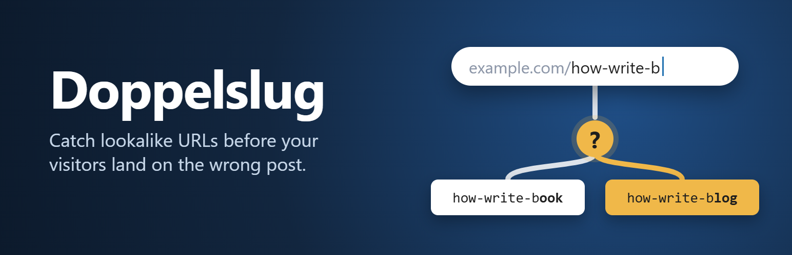

<div dir="rtl">

<p align="center">
  
</p>

<p align="center">
  <a href="README.md">English</a> · <b>فارسی</b>
</p>

# Doppelslug

افزونه‌ی وردپرسی که وقتی نامک (slug) یک نوشته یا برگه مثل نامک دیگری شروع می‌شود به نویسنده هشدار می‌دهد، تا نشانی‌های کوتاه‌شده یا اشتباه‌تایپ‌شده بازدیدکننده را به نوشته‌ی اشتباه نبرند.

## مشکل چیست؟

وقتی کسی نشانی‌ای را باز می‌کند که وجود ندارد، وردپرس سعی می‌کند کمک کند: دنبال نوشته‌ی منتشرشده‌ای می‌گردد که نامکش با متن تایپ‌شده **شروع شود** و به آن هدایت می‌کند. با این دو نوشته:

</div>

```
example.com/how-write-book
example.com/how-write-blog
```

<div dir="rtl">

نشانی `example.com/how-write-b` با هر دو منطبق است. وردپرس اولین ردیفی را که پایگاه داده برمی‌گرداند انتخاب می‌کند و کوئری‌اش هیچ ترتیبی ندارد؛ پس مشخص نیست بازدیدکننده به کدام نوشته برسد. انتشار یک نوشته‌ی جدید هم می‌تواند بی‌صدا مقصد یک لینک کوتاه‌شده‌ی قدیمی را عوض کند.

## Doppelslug چه می‌کند؟

- **ویرایشگر بلوک (گوتنبرگ):** هشدار بالای صفحه با دکمه‌ی «نمایش جزئیات»، پنل «نشانی‌های مشابه» در نوار کناری، و بخشی در بررسی پیش از انتشار.
- **ویرایشگر کلاسیک:** کادر «نشانی‌های مشابه» که فقط وقتی موردی برای هشدار هست بالای نوار کناری ظاهر می‌شود و با ویرایش نامک به‌روز می‌شود.
- **هشدار روشن:** هر هشدار نشان می‌دهد بازدیدکننده چه نشانی‌ای ممکن است تایپ کند، کدام نوشته‌ها ممکن است باز شوند، و آن نشانی همین الان به کجا می‌رود (با همان کوئری خود وردپرس).
- **اصلاح اختیاری** در «تنظیمات ← Doppelslug»: رفتار پیش‌فرض وردپرس، هدایت فقط وقتی یک نوشته منطبق است، فقط تطابق کامل نامک، یا هرگز هدایت نکن.
- **حساسیت قابل تنظیم:** حساس، متعادل (پیش‌فرض) یا آسان‌گیر.
- **دوزبانه:** فارسی و انگلیسی، با پشتیبانی کامل از راست‌به‌چپ. بر اساس زبان سایت یا زبان پروفایل کاربر نمایش داده می‌شود؛ زبان‌های دیگر انگلیسی می‌بینند.
- **سبک:** بدون جدول دیتابیس، بدون ردیابی، بدون درخواست بیرونی. در بخش عمومی سایت فقط روی صفحه‌های «یافت نشد» اجرا می‌شود.

## نصب

1. آخرین فایل ZIP را از [Releases](https://github.com/ararai1991/doppelslug/releases) دانلود کنید.
2. در پیشخوان وردپرس به «افزونه‌ها ← افزودن ← بارگذاری افزونه» بروید، فایل را انتخاب و افزونه را فعال کنید.
3. یک نوشته یا برگه را ویرایش کنید؛ اگر نامکش مثل نامک نوشته‌ی منتشرشده‌ی دیگری شروع شود، هشدار می‌بینید.

نیازمندی‌ها: وردپرس ۶٫۶ یا بالاتر و PHP 7.4 یا بالاتر. با نوشته‌ها، برگه‌ها و انواع نوشته‌ی سفارشی عمومی کار می‌کند و نامک‌های فارسی را هم پشتیبانی می‌کند.

## توسعه و مشارکت

راهنمای اجرای تست‌ها و ساخت فایل‌ها در [README.md](README.md) و [CONTRIBUTING.md](CONTRIBUTING.md) است. گزارش مشکل، پیشنهاد و ترجمه خوش‌آمد است. مشکلات امنیتی را طبق [SECURITY.md](SECURITY.md) به‌صورت خصوصی گزارش کنید.

## مجوز

[GPL-2.0-or-later](LICENSE)، مثل خود وردپرس.

</div>
