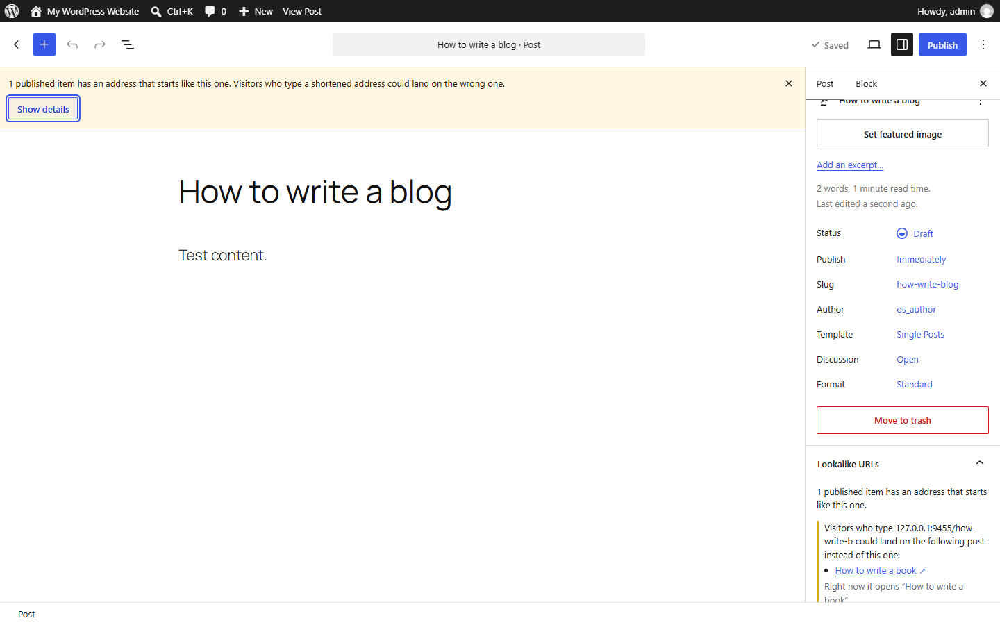
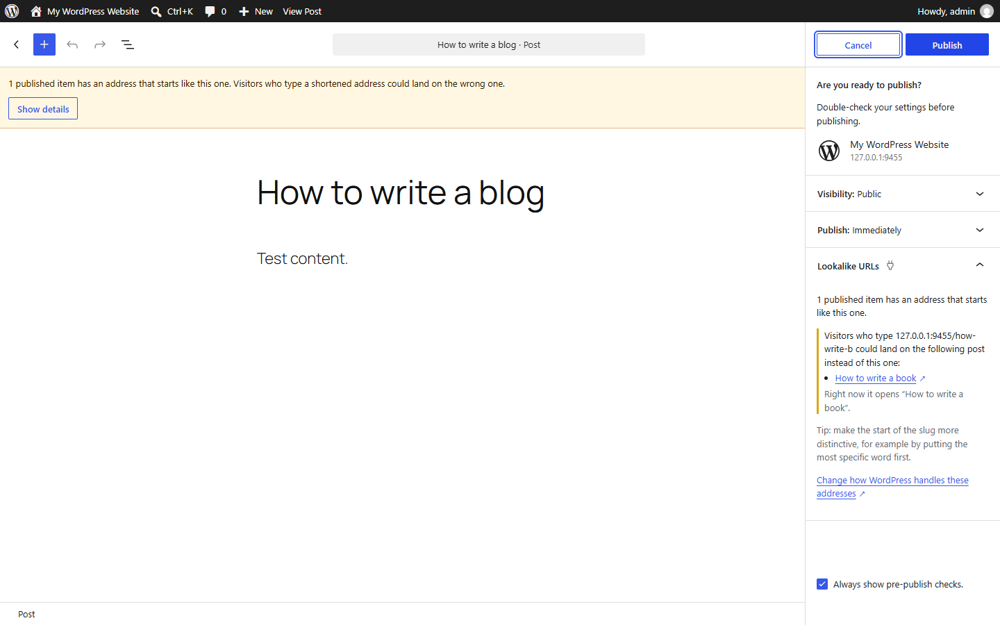
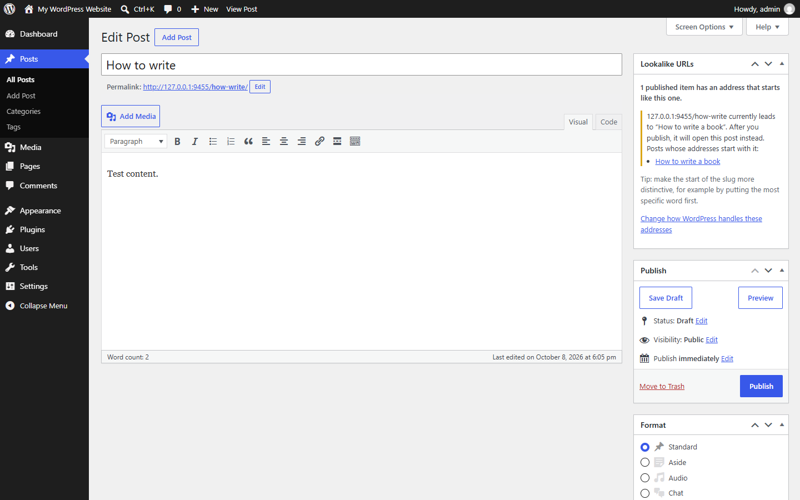
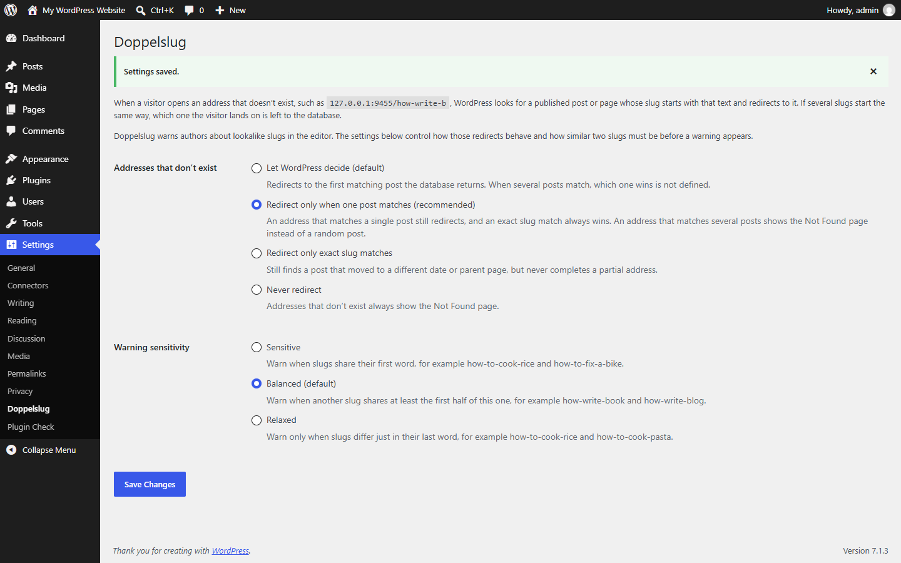

<p align="center">
  
</p>

<p align="center">
  <a href="LICENSE"></a>
  
  
  
  <a href="https://github.com/ararai1991/doppelslug/actions/workflows/ci.yml"></a>
</p>

<p align="center">
  <b>English</b> · <a href="README.fa.md">فارسی</a>
</p>

# Doppelslug

A WordPress plugin that warns authors when a post or page slug starts like another one, so shortened or mistyped addresses can't send visitors to the wrong post.

## The problem

When someone opens an address that doesn't exist, WordPress tries to help: it finds a published post whose slug *starts with* what was typed and redirects there (`redirect_guess_404_permalink()`). With these two posts:

```
example.com/how-write-book
example.com/how-write-blog
```

`example.com/how-write-b` matches both. WordPress takes the first row the database returns from a query with no sort order, so which post wins is undefined. Publishing a new post can also quietly change where an existing, shortened link goes.

## What Doppelslug does

- **Block editor:** a warning notice with a **Show details** button, a **Lookalike URLs** panel in the post sidebar, and a section in the pre-publish check.
- **Classic Editor:** a **Lookalike URLs** box that appears at the top of the sidebar only while there is something to warn about, and updates as you edit the slug.
- **Clear warnings:** each one shows the address visitors could type, the posts it could open, and where it leads right now, worked out with the same SQL WordPress itself runs.
- **Optional fix** under *Settings → Doppelslug*: keep WordPress's behaviour (the default), redirect only when one post matches, redirect only exact slug matches, or never redirect.
- **Adjustable sensitivity:** warn when slugs share their first word, at least half the slug (default), or everything but the last word.
- **English and Persian (فارسی)**, right-to-left included. It follows the site or profile language; other languages fall back to English.
- **Light:** no custom tables, no tracking, no external requests. On the front end it only runs on Not Found requests.

## Screenshots

| Block editor | Pre-publish check |
| --- | --- |
|  |  |
| **Classic Editor** | **Settings** |
|  |  |

## Installation

1. Download the latest ZIP from [Releases](https://github.com/ararai1991/doppelslug/releases), or build one with `python bin/build-zip.py`.
2. In WordPress, go to *Plugins → Add New → Upload Plugin*, choose the ZIP, then activate it.
3. Edit any post or page. A warning appears when its slug starts like another published one.

Requires WordPress 6.6+ and PHP 7.4+. Works with posts, pages, and public custom post types, including non-Latin slugs (Persian, Arabic, Cyrillic, …). WordPress only completes partial addresses when pretty permalinks are on, so with plain permalinks the plugin stays quiet.

## FAQ

**Does it change my redirects?**
Only if you choose a different option under *Settings → Doppelslug*. By default it only warns.

**Who sees the warnings?**
Anyone who can edit the post. Only administrators see the link to the settings.

**What does it store?**
One option holding the two settings. Deleting the plugin removes it.

## Development

```
doppelslug/          The plugin. Only this folder is shipped.
tests/               Integration, browser and Plugin Check scripts (WordPress Playground)
bin/                 Release ZIP builder and listing-asset renderer
.wordpress-org/      Banner, icon and screenshots for the WordPress.org listing
```

```bash
composer install     # WordPress Coding Standards, PHPCompatibility, WP-CLI i18n
composer lint        # phpcs on doppelslug/
composer i18n        # regenerate the POT and rebuild the Persian .mo and JavaScript .json files
npm install          # playwright-core for the browser checks (uses your installed Edge or Chrome)
```

Start a local WordPress with WordPress Playground (Node 20.10+; on Git Bash keep `MSYS_NO_PATHCONV=1`):

```bash
MSYS_NO_PATHCONV=1 npx @wp-playground/cli@3.1.54 server --port=9455 --workers=1 \
  --mount-dir "$PWD/doppelslug" /wordpress/wp-content/plugins/doppelslug \
  --mount-dir "$PWD/tests/playground" /wordpress/doppelslug-tests \
  --blueprint=tests/playground/blueprint.json
```

Then run the checks:

```bash
bash tests/run-playground-tests.sh   # REST checks, permissions, every redirect mode, languages, uninstall, PHP notices
node tests/browser-check.mjs         # both editors in a real browser, in English and Persian
python tests/plugin-check.py         # the official Plugin Check, through its admin AJAX API
```

Use `tests/playground/blueprint-minimum.json` on another port to test the minimum versions (WordPress 6.6, PHP 7.4). See [CONTRIBUTING.md](CONTRIBUTING.md) for details and [PUBLISHING.md](PUBLISHING.md) for the release process.

## Contributing and security

Bug reports, ideas and translations are welcome; see [CONTRIBUTING.md](CONTRIBUTING.md). Please report security issues privately as described in [SECURITY.md](SECURITY.md).

## License

[GPL-2.0-or-later](LICENSE), like WordPress itself.
